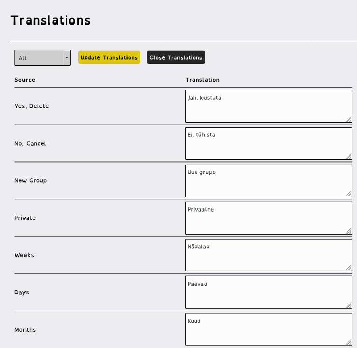

{: .Translation}

# Translations
{:.no_toc}

* TOC
{:toc}

{: .Translations}

## Add language translation to server framework

## Sort by Translated, not translated or Missing Sources

## Supports UTF-8 and Unicode
